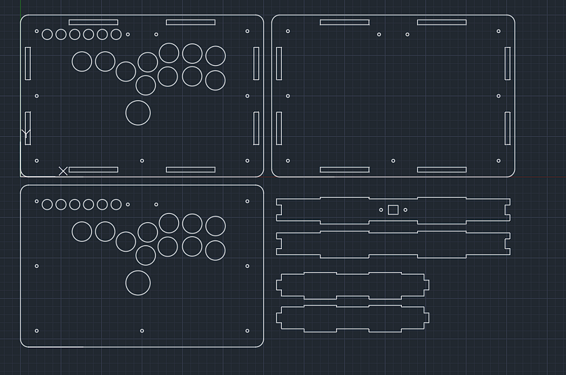

# HITBOX仓库
### source author：超频A 
### manager：error_11037
**(本项目为开源项目，未经允许不得进行商用)**

## **Hitbox_standard**
-   **文件名**：Hitbox_standard.dwg
-   **尺寸**：300_200_27 , USB type B
-   **按键尺寸(直径)：**

    |方向键 | 跳键 |  拳脚 | 功能 |
    |----   |----   |----   |----  |
    |  24     |   30    |   24    |   12.5   |

-   **样式**
    

<!-->----------------------------------------------------<!-->

## **Hitbox_standard_bigButton**
-   **文件名**：Hitbox_standard_bigButton.dwg
-   **尺寸**：300_200_27 , USB type B
-   **按键尺寸(直径)：**

    |方向键 | 跳键 |  拳脚 | 功能 |
    |----   |----   |----   |----  |
    |  30     |   30    |   30    |   12.5   |

-   **样式**
    

<!-->----------------------------------------------------<!-->

## **Hitbox_standard_gachikun**
-   **文件名**：Hitbox_standard_gachikun.dwg
-   **尺寸**：312_212_34 , USB type B
-   **按键尺寸(直径)：**

    |方向键 | 跳键 |  拳脚 | 功能 |
    |----   |----   |----   |----  |
    |  24     |   30    |   24    |   12.5   |

-   **样式**

    

<!-->----------------------------------------------------<!-->

## **Hitbox_standard_thickpad**
-   **文件名**：Hitbox_standard_thick.dwg
-   **尺寸**：300_200_27 , USB type B
-   **按键尺寸(直径)：**

    |方向键 | 跳键 |  拳脚 | 功能 |
    |----   |----   |----   |----  |
    |  24     |   30    |   24    |   12.5   |

-   **样式**

    

<!-->----------------------------------------------------<!-->

## **Hitbox_standard_thickpad**
-   **文件名**：Hitbox_standard_thick.dwg
-   **尺寸**：300_200_27 , USB type B
-   **按键尺寸(直径)：**

    |方向键 | 跳键 |  拳脚 | 功能 |
    |----   |----   |----   |----  |
    |  24     |   30    |   24    |   12.5   |

-   **样式**

    

<!-->----------------------------------------------------<!-->

## **Hitbox_standard_wasd**
-   **尺寸**：300_200_27 , USB type B
-   **按键尺寸(直径)：**

    |wasd | 跳键 |  拳脚 | 功能 |
    |----   |----   |----   |----  |
    |  24     |   30    |   30    |   12.5   |

-   **样式**

    Hitbox_wasd_1up.dwg
    

    Hitbox_wasd_2up.dwg
    

<!-->----------------------------------------------------<!-->

## **Hitbox_big**
-   **文件名**：Hitbox_big.dwg
-   **尺寸**：390_220_55 , USB type B
-   **按键尺寸(直径)：**

    |方向键 | 跳键 |  拳脚 | 功能 |
    |----   |----   |----   |----  |
    |  24     |   30    |   24    |   24  |

-   **样式**

    

<!-->----------------------------------------------------<!-->

## **Hitbox_bigHitbox_big_cross**
-   **尺寸**：390_220_27 , USB type B
-   **按键尺寸(直径)：**

    |方向键 | 跳键 |  拳脚 | 功能 |
    |----   |----   |----   |----  |
    |  24     |   30    |   24    |   24/30  |

-   **样式**

    Hitbox_big_cross.dwg
    

    Hitbox_big_cross_planB.dwg
    
